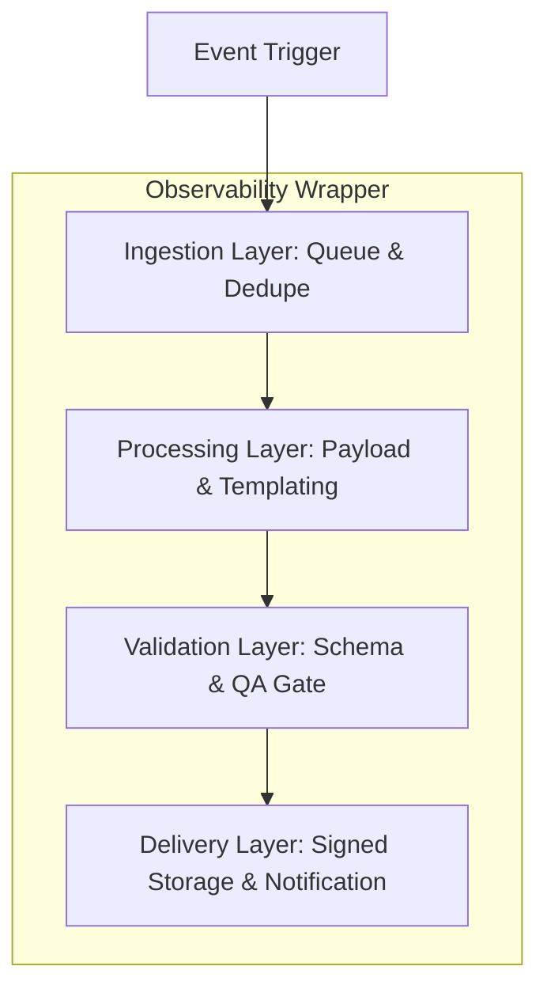

## Why reporting pipelines fail

Most teams bolt reporting onto existing data jobs. When volume spikes, retries flood downstream systems. Without idempotency and observability, you get duplicate sends, missing PDFs, and late nights. 

We recently built a platform that handles hundreds of complex executive reports nightly. Here is the technical breakdown of how we achieved **98.5% success** with zero manual QA.

## The Architecture in Four Layers

To ensure resilience, we decoupled the lifecycle of a report into four distinct, observable stages:



### 1. Ingestion: The Gatekeeper
Event triggers fan out jobs to a Redis-backed queue with strict dedupe keys. We use **correlation IDs** that persist from the initial trigger to the final delivery.

### 2. Processing: Stateless Workers
Workers are designed to be entirely stateless. They pull the required data slices, generate the report payload, and call a versioned template service.

### 3. Validation: The QA Gate
Before any file reaches a stakeholder, a dedicated QA gate checks:
- **Schema Validation**: Does the payload match the template expectations?
- **Totals Check**: Do the numbers in the report sum up correctly against the source data?
- **Formatting**: Are there any visual anomalies in the generated PDF/HTML?

### 4. Delivery: Signed Storage
Files are stored in S3, links are signed with a short TTL, and notifications are sent via Resend or Slack with full trace logs attached.

---

## Technical Deep-Dive: Idempotency & Retries

One of the most critical patterns we implement is the **Idempotency Check**. In a distributed system, a worker might crash *after* successfully generating a report but *before* marking the job as complete. Without idempotency, a retry would result in a duplicate file.

We use a "Claim-Check" pattern with Redis:

```typescript
async function processReport(job) {
  const jobId = createJobId(job.data.event);
  
  // 1. Check if already processed
  const status = await redis.get(`report_status:${jobId}`);
  if (status === 'COMPLETED') {
    logger.info(`Job ${jobId} already completed, skipping.`);
    return;
  }

  // 2. Claim the job with a TTL
  const lock = await redis.set(`report_lock:${jobId}`, 'PROCESSING', 'EX', 300, 'NX');
  if (!lock) throw new Error('Could not acquire lock, job likely being processed');

  try {
    const payload = await generatePayload(job.data);
    const reportUrl = await templateService.render(payload);
    
    // 3. Finalize
    await redis.set(`report_status:${jobId}`, 'COMPLETED');
    return { reportUrl };
  } catch (err) {
    await redis.del(`report_lock:${jobId}`); // Release lock on failure
    throw err;
  }
}
```

## Guardrails that mattered

- **Idempotency keys** on every job to prevent duplicates.
- **Structured logs** with correlation IDs across services (using Pino + OpenTelemetry).
- **Synthetic canary reports** every hour to verify the pipeline is healthy even when no real jobs are running.
- **Budget-based concurrency** to avoid hammering downstream data sources during volume spikes.

## Outcomes

- **156 reports** generated in a demo run under 10 minutes.
- **98.5% success rate** with automated QA rejecting the rest.
- **2.4s average generation time** per report.
- **90% reduction** in manual analyst effort.

## What to adopt in your stack

1. **Start with observability**: Tracing + logs + dashboards before feature work. If you can't see it, you can't fix it.
2. **Version your templates**: Keep templates in a separate service or repo, versioned and testable without production data.
3. **Make failures loud**: Stale dashboards are worse than no dashboards. Use real-time alerts (Slack/PagerDuty) for the QA gate failures.

If you want to see the full playbook or run a canary on your data, we are happy to share our deployment scripts. Grab a time with us [here](/contact).
